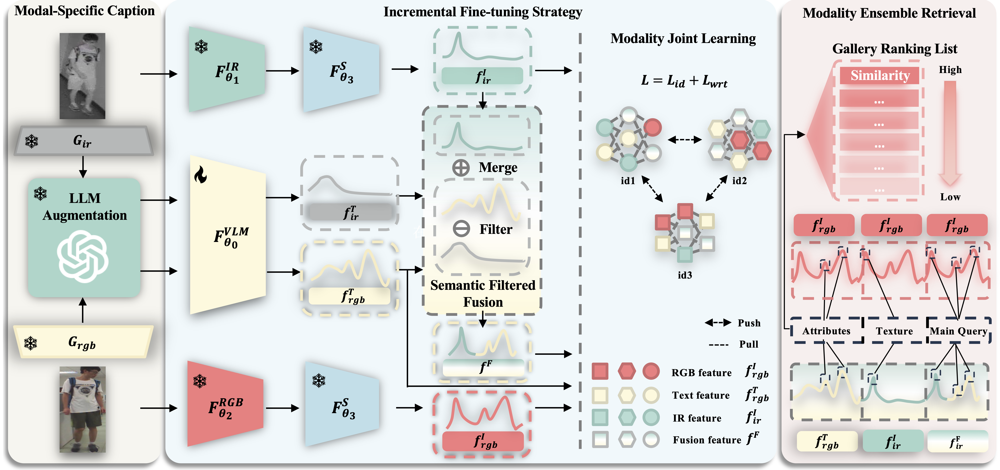

# Empowering Visible-Infrared Person Re-Identification with Large Foundation Models

The *official* repository for [Empowering Visible-Infrared Person Re-Identification with Large Foundation Models](https://openreview.net/pdf?id=qQlmONeI5k). TVI-LFM greatly mitigates the color information absence in the infrared modality by enriching the infrared representaitons with VLM generated texts, which is a **cross-modality retrieval task bolstered by heterogeneous text descriptions**.

**The overall framework**


# Highlight

1. We design a Text-enhanced VI-ReID framework driven by Large Foundation Models (TVI-LFM). It enriches infrared representations with generated textual descriptions, effectively mitigating the absence of critical information, e.g. color, in the infrared modality and significantly improving the performance of cross-modal retrieval.
2. We propose IFS that fine-tunes a pre-trained VLM to align generated texts with original images. It creates a fusion modality to learn complementary information from the infrared modality and jointly aligns features across all modalities. This ensures stable semantic consistency of text and fusion features with the visible modality during complementary information learning.
3. We propose Modality Ensemble Retrieval that leverages the complementary strengths of all query modalities to form ensemble queries, further improving the performance of cross-modality retrieval bolstered by heterogeneous text descriptions.
4. We introduce three extended VI-ReID datasets with VLM-generated textual descriptions for every image. Extensive experiments on these expanded datasets demonstrate the competitive performance of our TVI-LFM framework, paving the way for utilizing large foundation models in downstream data-demanding multi-modal retrieval tasks.

# Prepare Datasets
* Put *SYSU-MM01*, *RegDB* and *LLCM* dataset into `datasets/sysu`, `data/regdb`, and `data/llcm`, as the following structure:
```
data_root
├── llcm
│   ├── idx
│   ├── nir
│   ├── test_nir
│   ├── test_vis
│   ├── Text
│   └── vis
├── regdb
│   ├── idx
│   ├── Text
│   ├── Thermal
│   └── Visible
└── sysu
    ├── cam1
    ├── cam2
    ├── cam3
    ├── cam4
    ├── cam5
    ├── cam6
    ├── exp
    ├── Text
    ├── train_ir_resized_img.npy
    ├── train_ir_resized_label.npy
    ├── train_rgb_resized_img.npy
    └── train_rgb_resized_label.npy
```


* then run `dataloader/pre_data_processing.py` to process SYSU-MM01 dataset.
* There **have been** generated texts and LLM augmented texts for each image in the corresponding dataset directory `datasets/sysu/Text`, `datasets/regdb/Text` and `datasets/llcm/Text`.


# Open-Sources Zoos
We provide all texts of expanded datasets, weights and training logs of **pretrained base VI-ReID models** [[google drive]](https://drive.google.com/drive/folders/1DiyE1ySdWmAiNtWnG01FemZSbl2uR9aP?usp=drive_link) and **trained models** [[google drive]](https://drive.google.com/drive/folders/1CoUks3X7_ORui8Rj-Zxw317YhpKO2-yQ?usp=drive_link) for TVI-LFM on three expanded datasets.

# Usage
We utilize a single Nvidia RTX 3090 GPU for training.

**Dependencies:**

First of all, **cd to the root directory of TVI-LFM**:
```
cd path/to/TVI-LFM
```
Then, create a new conda environment:
```
conda create -n TVI-LFM python=3.10.4
```
Finally, install dependencies:
```
pip install -r requirements.txt
```

**parameters:**

* `--mode train` # train or test
* `--training_mode` # RGB_IR for base training and RGB_IR_Text for TVI-LFM
* `--captioner_name` # the name of the captioner, here we use Blip.
* `--llm_aug` # whether to use LLM augmented texts
* `--joint_mode` # uni for MJL, ir_crossfusion for base training and baseline with text
* `--Feat_Filter` # Whether to use SFF
* `--lr_txt` # learning rate for text
* `--text_weight_decay` # weight decay for text
* `--text_weight_decay_bias` # weight decay for text bias
* `--fusion_way` # the way to fuse the features, 'add' as default
* `--Fix_Visual` # first we train a base model, then we fix it and fine-tune the text encoder (CLIP)
* `--training_weight_init` # the path to the base model weights
* `--output_path` # the output path of logs and weights
* `--dataset` # sysu, regdb or llcm
* `--loss_names` # choose the type of loss functions, here we use id and wrt loss
* `--test_modality`  # Fusion or IR (->RGB)
* `--eval_start_epoch` # the epoch to start evaluation
* `--CUDA_VISIBLE_DEVICES` # visible GPU
* `--gpu_id` # chosen GPU
* `--trial` # the split number of RegDB
* `--CAT_EVAL` # whether to use ensemble retrieval
* `--LOG4TEST` # whether to log the test results


**Examples:**

Tri-SYSU-MM01:

Step 1. Download the **pretrained base VI-ReID models** [[google drive]](https://drive.google.com/drive/folders/1DiyE1ySdWmAiNtWnG01FemZSbl2uR9aP?usp=drive_link) and put it to `base_model/sysu/`,

or,

train the base model by yourself:
```shell
bash scripts/base_training/sysu_base_run.sh
```
The trained ckpt of base models and logs can be found in `logs/sysu/base`.
Then we need to put the base model weights into `base_model/sysu/`.

Step 2. Incrementally train the TVI-LFM **w/o MER**:(need to input the path to the base model weights)
```shell
bash scripts/training/sysu_train_run.sh
```
We can find the log files and weights save in `logs/sysu/`. 

Step 3. Test trained models **with MER** module: (need to input the path to the **trained models** [[google drive]](https://drive.google.com/drive/folders/1CoUks3X7_ORui8Rj-Zxw317YhpKO2-yQ?usp=drive_link))
```shell
bash scripts/testing/sysu_test.sh
```
Through MER we can get further improved retrieval performance.


**Note**: The results may slightly vary due to the different types of GPUs and different versions of CUDA. Don't mind the `GIT`, it doesn't participate in training process, please keep it there to keep the randomness of the training process of TVI-LFM.

# Generators
We provide the weights and inference code of the LLM rephraser [Vicuna-7b v1.5](https://huggingface.co/lmsys/vicuna-7b-v1.5) and IR & RGB modality-specific text generators [BLIP](https://huggingface.co/Salesforce/blip-image-captioning-large) in `./generators/`. The code is based on Huggingface's Transformers library.

# Acknowledgments

Some components of this code implementation are adopted from [CLIP](https://github.com/openai/CLIP), [DEEN](https://github.com/ZYK100/LLCM), [UNIReID](https://github.com/ccq195/UNIReID) and [CAJ](https://github.com/zesenwu23/caj) and [Documents from hugginface](https://huggingface.co/docs/transformers/main/en/tasks/image_captioning). We sincerely appreciate for their contributions.


# Citation
If you find this code useful for your research, please cite our paper.

```
@inproceedings{2024TVI-LFM,
    title={Empowering Visible-Infrared Person Re-Identification with Large Foundation Models},
    author={Zhangyi Hu and Bin Yang and Mang Ye},
    booktitle={The Thirty-eighth Annual Conference on Neural Information Processing Systems},
    year={2024},
}
```

# Contact
zhangyi_hu@whu.edu.cn; yangbin_cv@whu.edu.cn; yemang@whu.edu.cn.

